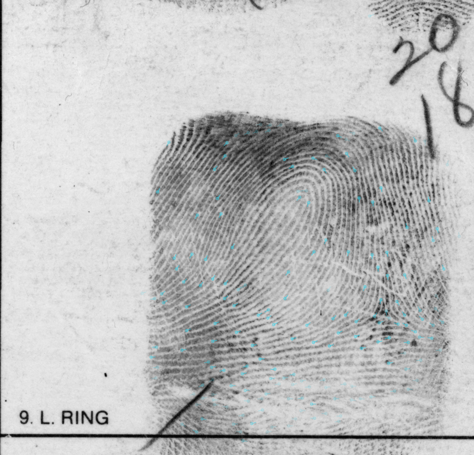

# mntviz

Self-contained biometric visualization library for fingerprint minutiae, directional fields, and image overlays.

- **Vanilla JavaScript** — ES modules, zero external dependencies, no build step
- **SVG-based rendering** — minutiae markers, UV arrow fields, quality/angle labels
- **Interactive viewer** — pan, zoom (0.1×–20×), minimap, overlay stacking
- All CSS classes prefixed with `.mntviz-` to avoid conflicts

## Files

| File | Export | Description |
|------|--------|-------------|
| `index.js` | barrel | Re-exports all public APIs |
| `viewer.js` | `Viewer` | Interactive image canvas with pan/zoom and minimap |
| `minutiae-renderer.js` | `MinutiaeRenderer`, `parseMinutiaeText` | SVG minutiae circles with direction lines |
| `uv-renderer.js` | `UVFieldRenderer` | SVG directional field arrows |
| `overlay.js` | `OverlayLayer` | Image overlay with opacity control (heatmaps, masks) |
| `mntviz.css` | — | Component styles |

## How to use in your project

### 1. Copy the source

Copy the `src/` directory into your project's static assets folder:

```
your-project/
  static/
    mntviz/        ← copy of src/
      index.js
      viewer.js
      minutiae-renderer.js
      uv-renderer.js
      overlay.js
      mntviz.css
```

### 2. Include CSS

```html
<link rel="stylesheet" href="/static/mntviz/mntviz.css">
```

### 3. Import modules

```javascript
import { Viewer, MinutiaeRenderer, parseMinutiaeText, UVFieldRenderer, OverlayLayer }
  from './mntviz/index.js';
```

### 4. Minimal example

```html
<!DOCTYPE html>
<html>
<head>
  <link rel="stylesheet" href="/mntviz/mntviz.css">
  <style>
    #viewer { width: 800px; height: 600px; }
  </style>
</head>
<body>
  <div id="viewer"></div>
  <script type="module">
    import { Viewer, MinutiaeRenderer } from './mntviz/index.js';

    const viewer = new Viewer('#viewer');
    await viewer.loadImage('/path/to/fingerprint.png');

    const renderer = new MinutiaeRenderer(viewer.svgLayer);
    renderer.draw(
      [
        { x: 150, y: 200, angle: 45, quality: 90 },
        { x: 300, y: 180, angle: 120, quality: 60 },
      ],
      '#00ff00',
      { markerSize: 3, segmentLength: 8 }
    );
  </script>
</body>
</html>
```

## API reference

### `Viewer(container, options?)`

Interactive image viewer with pan/zoom.

- **container** — CSS selector or DOM element
- **options.minimap** — show minimap (default: `true`)
- **options.onResize** — callback after internal resize

| Property / Method | Description |
|-------------------|-------------|
| `.svgLayer` | SVG element for renderers to draw on |
| `.canvasContainer` | Container for overlay layers |
| `.imageSize` | `{width, height}` of loaded image |
| `.loadImage(src)` | Load image (returns Promise) |
| `.clear()` | Clear image and SVG layer |
| `.resetView()` | Fit image to viewport |
| `.destroy()` | Cleanup all listeners and DOM |

### `MinutiaeRenderer(svgElement)`

Draw minutiae as circles with directional lines.

| Method | Description |
|--------|-------------|
| `.draw(minutiae, color, options?)` | Render minutiae array |
| `.clear()` | Remove all drawn elements |

**minutiae format:** `Array<{x, y, angle, quality}>`

**draw options:** `markerSize` (default 2), `segmentLength` (5), `lineWidth` (1), `baseOpacity` (1.0), `showQuality` (false), `showAngles` (false)

### `parseMinutiaeText(text)`

Parse text-format minutiae (`"x y angle [quality]"` per line, `#` comments). Returns `Array<{x, y, angle, quality}>`.

### `UVFieldRenderer(svgElement)`

Draw directional field arrows.

| Method | Description |
|--------|-------------|
| `.draw(arrows, options?)` | Render arrow array |
| `.clear()` | Remove all arrows |

**arrows format:** `Array<[x, y, dx, dy, confidence]>`

**draw options:** `arrowSize` (3.0), `lineWidth` (1.2), `opacity` (1.0), `color` ('#43C4E4')

### `OverlayLayer(container, options?)`

Image overlay with opacity toggle.

- **options.opacity** — default visible opacity (default: `0.7`)
- **options.insertBefore** — DOM element to insert before (for stacking order)

| Method | Description |
|--------|-------------|
| `.load(src)` | Load overlay image (returns Promise) |
| `.show()` / `.hide()` / `.toggle()` | Visibility control |
| `.setOpacity(value)` | Set opacity (0–1) |
| `.clear()` | Remove source and hide |
| `.destroy()` | Remove from DOM |

## Browser requirements

Modern browsers with ES module support, `ResizeObserver`, and `AbortController`.

## Python wrapper (early implementation)

This repository now includes a Python package under `python/` with a Plotly-style API:

```python
from mntviz import plot_mnt

plot_mnt(minutiae, background_img=background_img, output_format="svg")
```

### Install locally

```bash
cd python
pip install -e .
```

### Supported outputs

- `svg`: returns SVG string (and optionally writes to `output_path`)
- `html`: returns standalone interactive HTML (pan/zoom)
- `jupyter`: returns a displayable object for inline notebook rendering

### Minutiae inputs

- Preferred: `.min` file path
- Preferred: `numpy.ndarray` with columns `x, y, angle, [quality]`
- Deprecated: dictionary-based rows (`[{"x":..., "y":..., ...}]`)

### Examples

```python
from mntviz import minutiae_from_min, plot_mnt
import numpy as np

minutiae_np = np.array([
  [150, 200, 45, 90],
  [300, 180, 120, 60],
], dtype=float)

# Optional: convert a .min file to numpy first
minutiae_np_from_min = minutiae_from_min("examples/sd258/000/minutiae/sd258_000_11-00_latent_bad.min")

# 1) SVG string + save to file
svg = plot_mnt(
  "examples/sd258/000/minutiae/sd258_000_11-00_latent_bad.min",
  background_img="fingerprint.png",
  output_format="svg",
  output_path="out/minutiae.svg",
)

# 2) Interactive HTML + save to file
html = plot_mnt(
  minutiae_np,
  background_img="fingerprint.png",
  output_format="html",
  output_path="out/minutiae.html",
  title="Fingerprint minutiae",
)

# 3) Jupyter inline
fig = plot_mnt(minutiae_np, background_img="fingerprint.png", output_format="jupyter")
fig
```

### Bundled SD258 sample files

- Latent image: `examples/sd258/000/images/sd258_000_11-00_latent_bad.png`
- Reference image: `examples/sd258/000/images/sd258_000_11-01_template_bad.png`
- Latent minutiae (`out_stitch`): `examples/sd258/000/minutiae/sd258_000_11-00_latent_bad.min`
- Reference minutiae (`out_stitch`): `examples/sd258/000/minutiae/sd258_000_11-01_template_bad.min`

### Jupyter notebook example

- Notebook: `python/notebooks/mntviz_sd258_example.ipynb`
- This notebook generates SVG and HTML assets under `python/docs/assets/`.

### Generated previews (from notebook)

Latent (`out_stitch` minutiae):


Reference (`out_stitch` minutiae):


